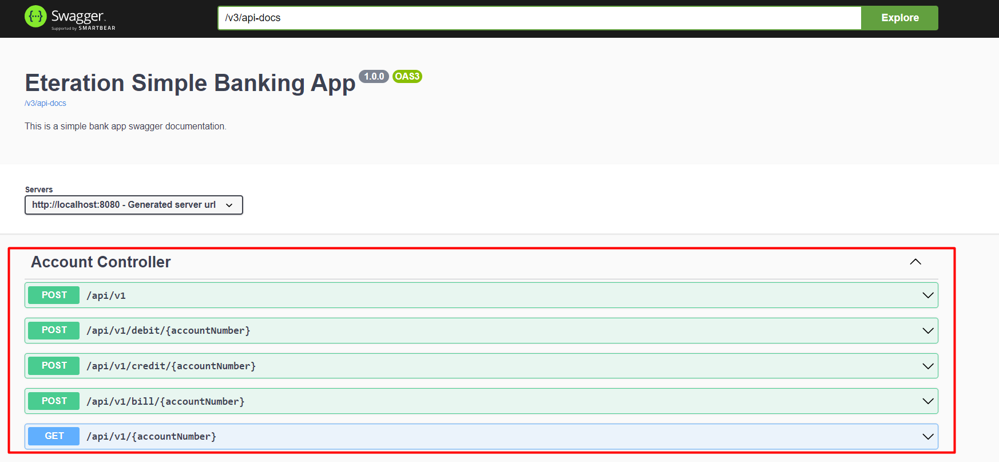
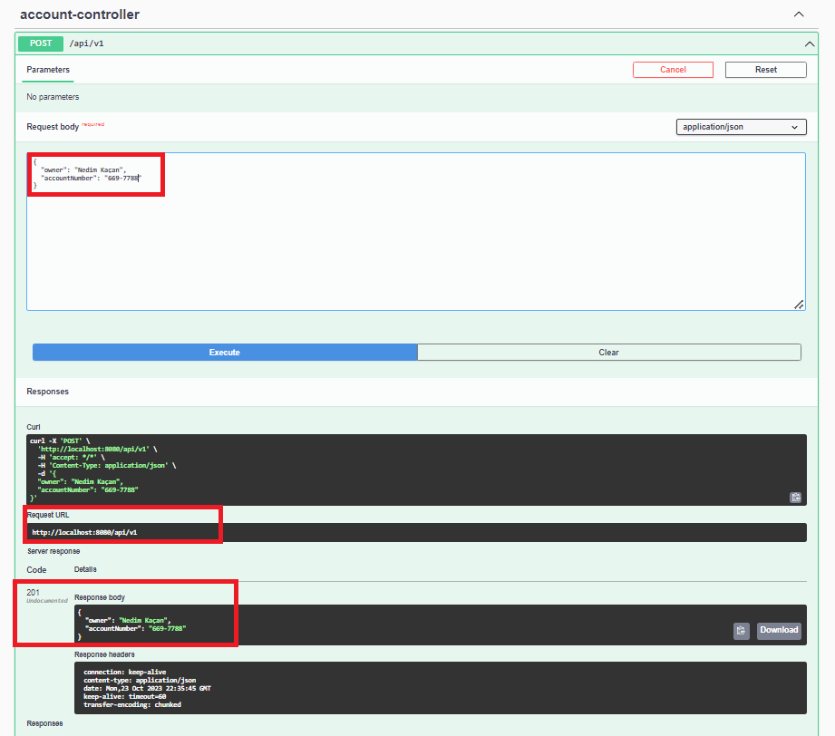
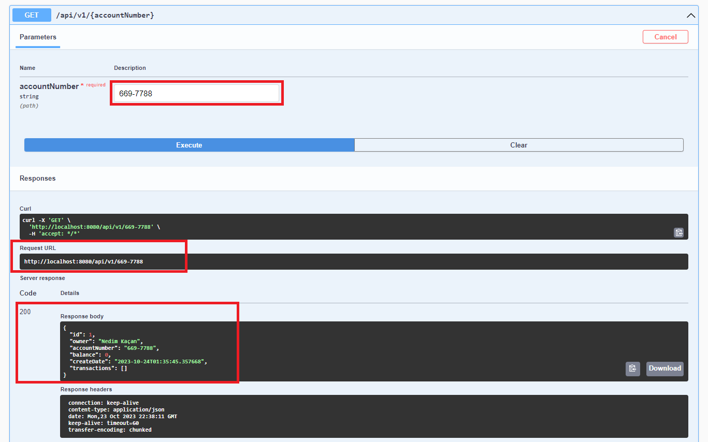
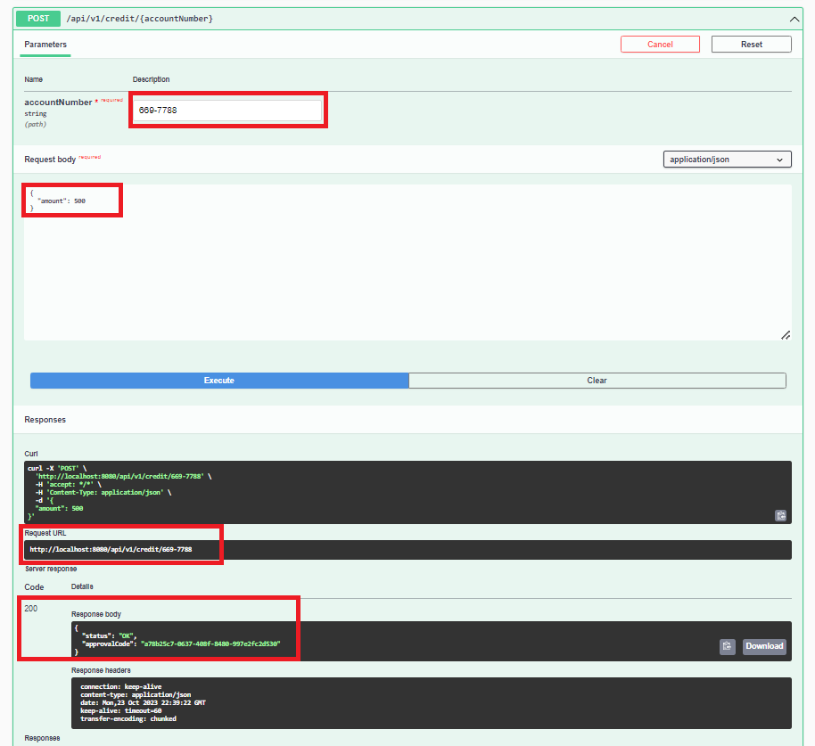
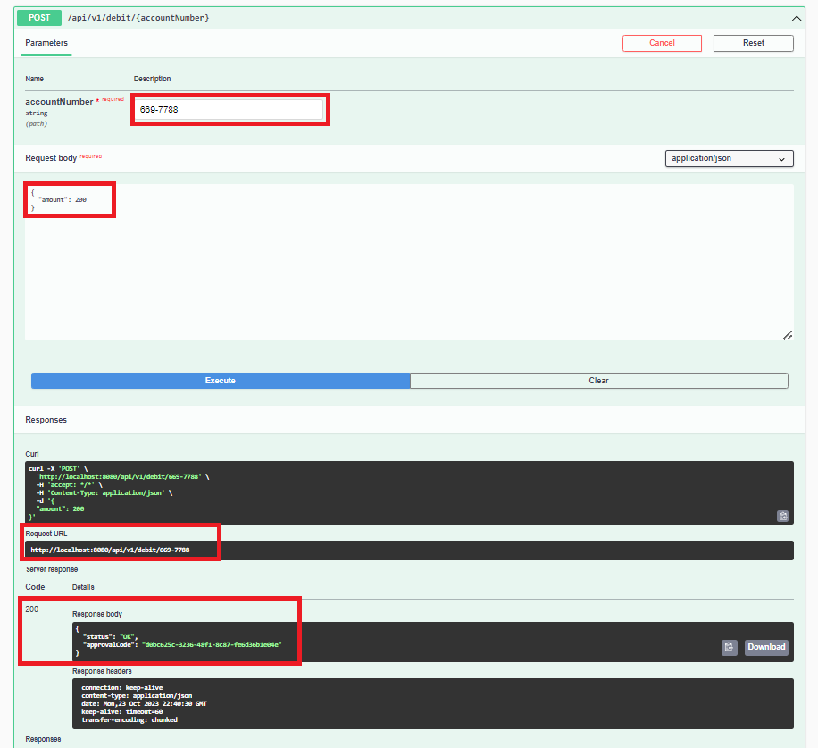
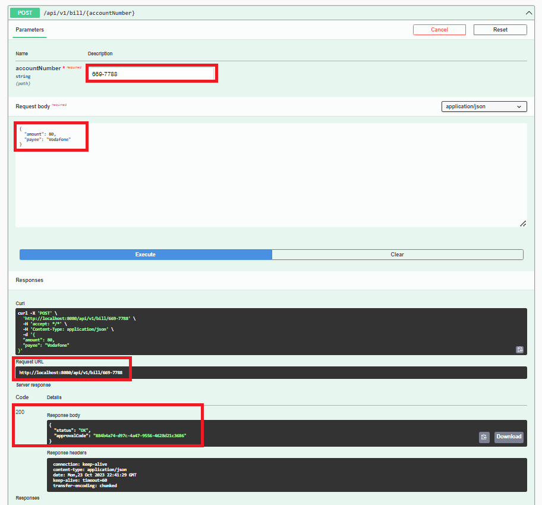
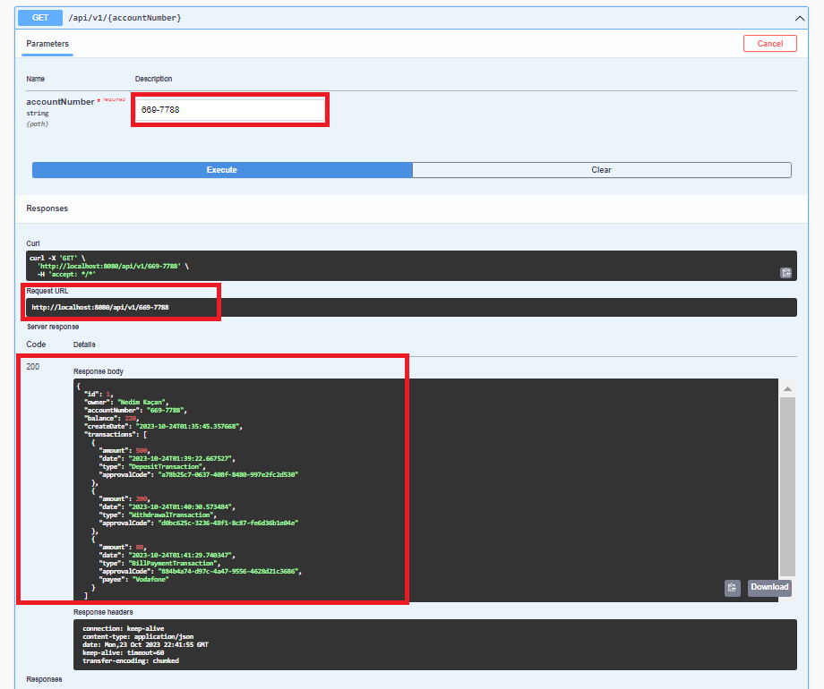

# Eteration Simple Bank App Documentation

This project is a basic banking application that performs inherited entity operations using spring boot.


## Run Project

Clone project

```bash
  git clone https://github.com/nedimkacanofficial/eteration-simple-bank.git
```

Run containers for the PostgreSQL database

```bash
  docker-compose -f docker-compose.yml up -d
```


After running the Spring Boot project, the Swagger interface address will be ready for testing at 

```bash
  http://localhost:8080/eteration-swagger-ui
```




The Swagger interface will appear as above. Here you are ready to do the testing.

## Create new account

Let's start by creating a new account:

    {
        "owner": "Nedim Kaçan",
        "accountNumber": "669-7788"
    }

After entering the information, let's make a post request to 

```bash
  http://localhost:8080/api/v1
```

After making a request, account information will be sent to us with the response code 201:
    
    {
        "owner": "Nedim Kaçan",
        "accountNumber": "669-7788"
    }



## Test the created account

After creating the account, we send a get request to 

```bash
  http://localhost:8080/api/v1/669-7788
```

after entering the account number information to test whether our account has actually been created. This will show us the account information and transactions, if any, for the relevant account number:

    {
        "owner": "Nedim Kaçan",
        "accountNumber": "669-7788",
        "balance": 0,
        "createDate": "2023-10-24T02:43:07.421205",
        "transactions": []
    }


## Credit

To test the deposit we must first enter an account number. After entering the account number, we enter the amount of money we want to deposit in the body section:
    
    {
        "amount": 500
    }

We then send a post request to 

```bash
  http://localhost:8080/api/v1/credit/669-7788
```

From here to us:
    
    {
        "status": "OK",
        "approvalCode": "b86418e5-18d7-4b47-9c57-7e41cc06d341"
    }

If such a result is returned, the operation is successful, otherwise it is a failed operation.



## Debit

To test the withdrawal we must first enter an account number. After entering the account number, we enter the amount of money we want to deposit in the body section:
    
    {
        "amount": 200
    }

We then send a post request to 

```bash
  http://localhost:8080/api/v1/debit/669-7788
```

From here to us:
    
    {
        "status": "OK",
        "approvalCode": "eaa665c6-67b4-4d0d-9aa7-5c5b4e2a1b2f"
    }

If such a result is returned, the operation is successful, otherwise it is a failed operation.



## Bill

To test the bill payment process, we must first enter an account number. After entering the account number, we enter the amount of money and payee we want to deposit in the body section:
    
    {
        "amount": 100,
        "payee": "Vodafone"
    }

We then send a post request to 

```bash
  http://localhost:8080/api/v1/bill/669-7788
```

From here to us:
    
    {
        "status": "OK",
        "approvalCode": "a2cc05e2-0335-41ce-9764-7712c60977c3"
    }

If such a result is returned, the operation is successful, otherwise it is a failed operation.



## Account and Transaction

Finally, let's view our account information again because we have made a lot of transactions here and we are waiting for these transactions to come with our account information. To do this, we first enter our account number and send a get request to this address 

```bash
  http://localhost:8080/api/v1/669-7788
```

:
    
    {
        "owner": "Nedim Kaçan",
        "accountNumber": "669-7788",
        "balance": 200,
        "createDate": "2023-10-24T03:15:29.477038",
        "transactions": [
            {
                "amount": 500,
                "date": "2023-10-24T03:15:47.557589",
                "type": "DepositTransaction",
                "approvalCode": "6a251af8-32a9-4bfa-ad50-9bcfa69ee3ea"
            },
            {
                "amount": 200,
                "date": "2023-10-24T03:15:59.152445",
                "type": "WithdrawalTransaction",
                "approvalCode": "46d34ba9-05fc-4b82-a0ba-d812084483f6"
            },
            {
                "amount": 100,
                "date": "2023-10-24T03:16:21.454371",
                "type": "BillPaymentTransaction",
                "approvalCode": "10586d5d-4bd0-4ee9-ad49-718ce029048e",
                "payee": "Vodafone"
            }
        ]
    }
If we get a result like the one above, our transactions and account information have been recorded without any problems and we can list them whenever we want.



All these processes were to understand how a simple banking application basically works. Basically, banking systems have developed based on these steps.
